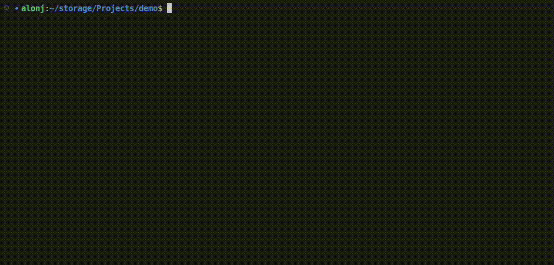

# Pytra

Pytra is a simple version-tracking tool for research code development. It allows you to track changes in your code, generate diffs, and even reconstruct code at specific points in time. Additionally, it can summarize diffs using various language models.

<!-- input an image -->



## Features

- Track changes in your Python scripts.
- Generate diffs between code runs.
- Summarize diffs using language models.
- Reconstruct code at specific points in time.
- Interactive Text User Interface (TUI) for managing diffs and configurations.

## Installation

To install the required dependencies, run:

```sh
pip install -r requirements.txt
```

## Usage
### Command Line Interface (CLI)
You can use Pytra from the command line to track and run your scripts. Here are some examples:
```sh
# Track and run a script
python pytra.py script.py

# Track and run a script, and generate a summary of the diff
python pytra.py script.py --summary

# Track all files in the current directory
python pytra.py script.py --wide

# Track all files in the current directory and subdirectories
python pytra.py script.py --recursive

# Launch the Pytra TUI
python pytra.py --tui
```

### Text User Interface (TUI)
Pytra also provides an interactive TUI for managing diffs and configurations. To launch the TUI, run:
```sh
python pytra.py --tui
```
or simply:
```sh
python pytra.py -t
```

In the TUI, you can:

- Scroll between diffs of code runs.
- Select a diff to view or reconstruct the code at that point in time.
- Configure Pytra settings such as the language model, summary generation, and file tracking options.

## Configuration

Pytra uses a configuration file located at `~/.pytra/pytra_conf.yaml`. The default configuration is:
```yaml
model: "Meta Llama 3.3"
summary: False
wide: False
recursive: False
```
You can modify these settings directly in the configuration file or through the TUI.

## Example
Here is an example of how to use Pytra:

1. Create a Python script example.py:
```python
print("Hello, world!")
```

2. Track the script using Pytra:
```python
python pytra.py example.py
```

3. Modify the script to print a different message:
```python
print("Goodbye, world!")
```

4. Track the script again:
```python
python pytra.py example.py
```

5. Launch the Pytra TUI:
```python
python pytra.py --tui
```

## License
This project is licensed under the MIT License. See the [LICENSE](LICENSE) file for details.
